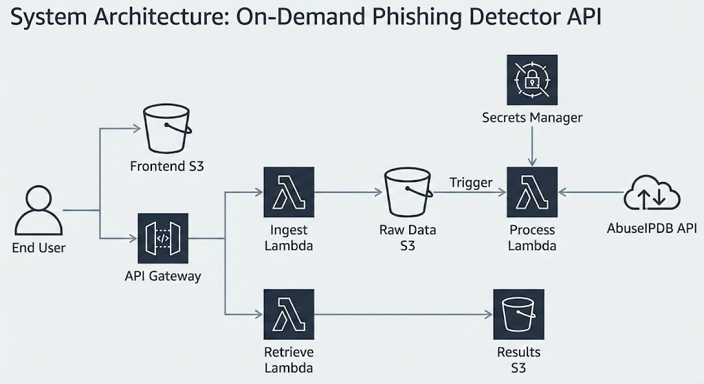
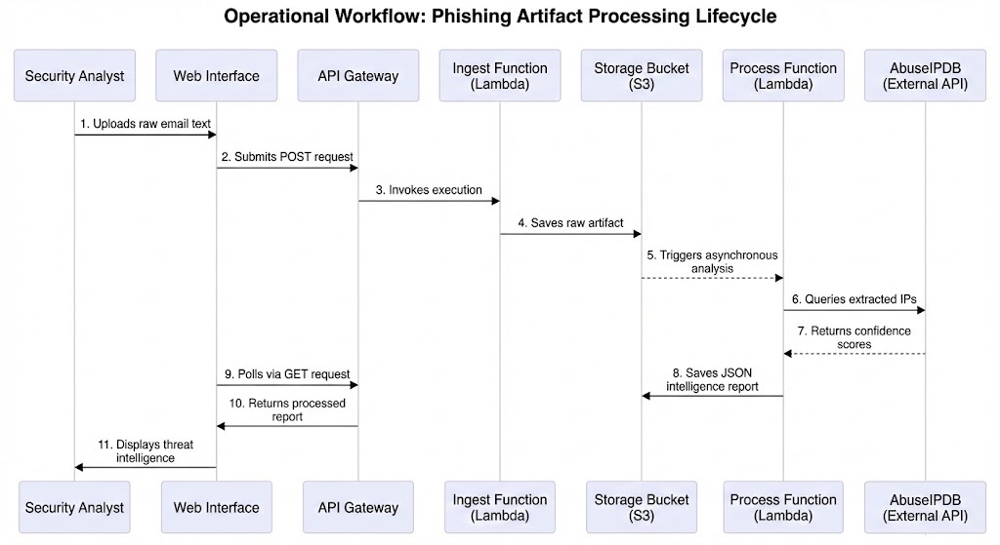

# Phish-Ripper

## On Demand Email Phishing API utilizing Open Source Threat Intelligence

This repository contains the infrastructure and application code for an automated phishing triage system. The project extracts network routing artifacts from raw email text and queries external intelligence feeds to generate abuse confidence scores. The resulting data accelerates the threat investigation lifecycle by providing immediate context regarding suspicious network infrastructure.

## System Architecture

The project utilizes a cloud native approach deployed via Terraform. The decoupled components ensure scalability and prevent resource bottlenecking during analysis. 



* Amazon API Gateway handles web requests and directs traffic to the ingestion computing functions
* Amazon Simple Storage Service provides isolated buckets for the static web interface raw email payloads and finalized intelligence reports
* AWS Lambda executes the Python logic for data extraction and external application programming interface queries
* AWS Secrets Manager securely retains external credentials protecting them from exposure in the application code



## Prerequisites

Execution requires the following tools and accounts.

* Terraform installed on the local machine
* An active AWS account containing an execution role with permissions to read and write to Simple Storage Service provision and invoke Lambda functions configure API Gateway integrations and access Secrets Manager payloads (This repository currently leverages AWS Learner Lab's LabRole for this purpose)
* A registered account with AbuseIPDB containing an active access key

## Deployment Instructions

The following sequence details the step by step process for provisioning the infrastructure and launching the application.

### Archiving the Backend Logic

The serverless computing functions require archived deployment packages. Navigate to the backend directory and archive the Python files into individual compressed folders. 

```bash
cd backend
zip ingest.zip ingest.py
zip process.zip process.py
zip retrieve.zip retrieve.py
cd ..
```

### Configuring Variables

Create a file named terraform.tfvars in the root directory. Insert the AbuseIPDB access key into this file. The version control configuration ignores this file to maintain credential security.

```hcl
abuseipdb_api_key = "INSERT_ACTUAL_KEY_HERE"
```

### Provisioning the Infrastructure

Initialize the working directory to download the necessary provider plugins.

```bash
terraform init
```

Apply the configuration to provision the cloud resources.

```bash
terraform apply
```

Confirm the deployment when prompted. Upon completion the terminal outputs the necessary endpoint addresses.

### Frontend Configuration

Copy the application programming interface endpoint address provided by the Terraform output. Open the frontend markup file named index.html and update the designated variable with this address.

Upload the updated markup file and the cascading style sheet to the newly created frontend storage bucket using the AWS Management Console. 

## Application Usage

Navigate to the static website address provided by the Terraform output. Upload a text file containing suspicious email headers. The interface automatically polls the backend and renders the final threat intelligence report as a JSON once processing concludes.

## Legal and Operational Disclaimers

This project is designed strictly for personal use, educational purposes, and portfolio demonstration. The architecture and integrated open source intelligence feeds must not be utilized for commercial applications or enterprise security operations.

* The AbuseIPDB free tier application programming interface prohibits commercial use and implementing this tool in a paid service requires a commercial licensing agreement
* Processing raw electronic mail files introduces significant data privacy risks since these artifacts contain personally identifiable information
* While the architecture utilizes the native 256 bit Advanced Encryption Standard provided by Amazon Simple Storage Service to secure raw artifacts at rest ensuring a baseline level of data privacy the storage configuration lacks the automated deletion policies required for strict enterprise compliance frameworks
* The infrastructure is optimized for demonstration workloads and utilizes shared laboratory execution roles rather than dedicated identity and access management controls
